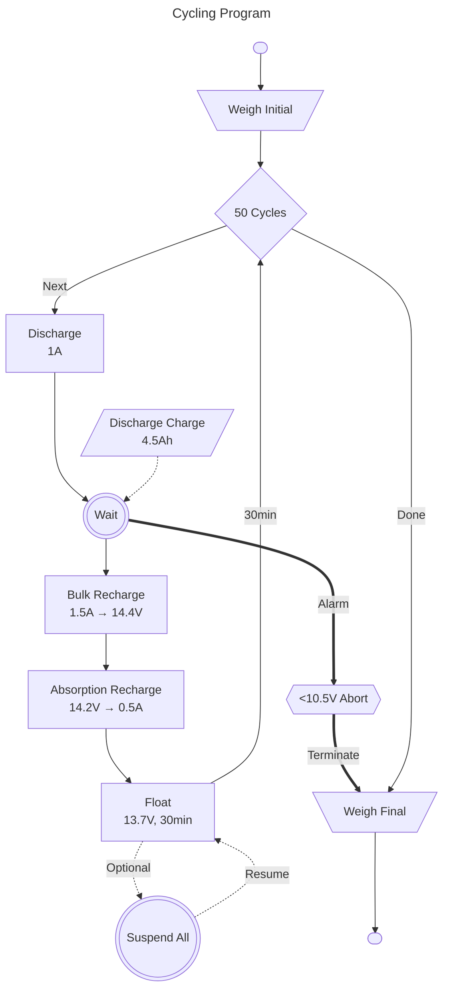
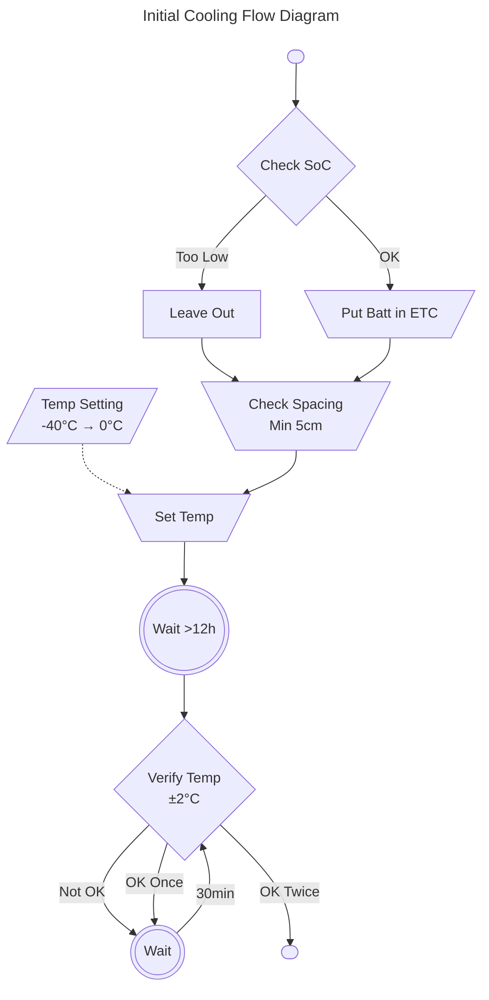
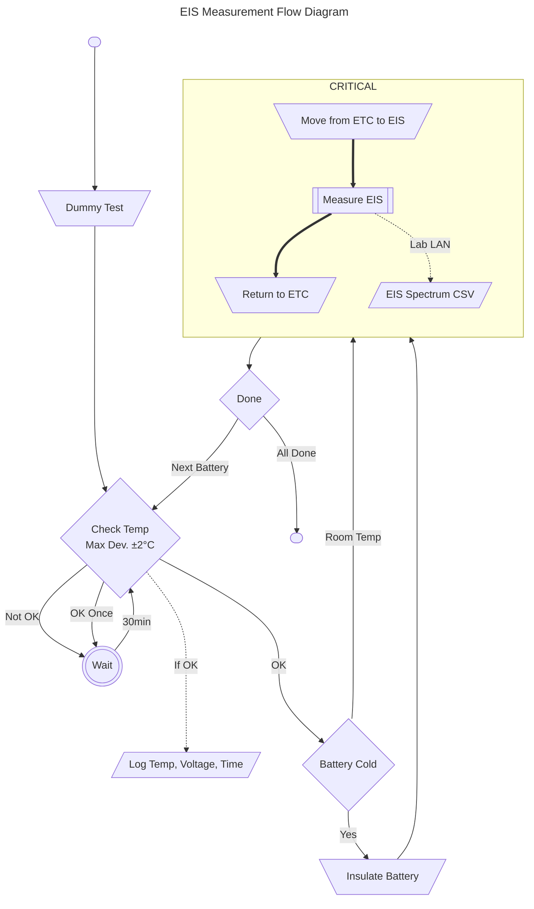
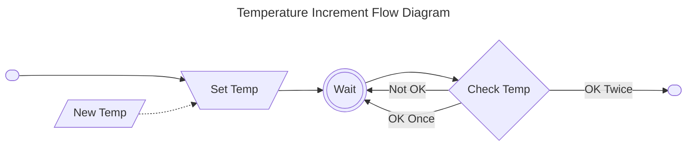
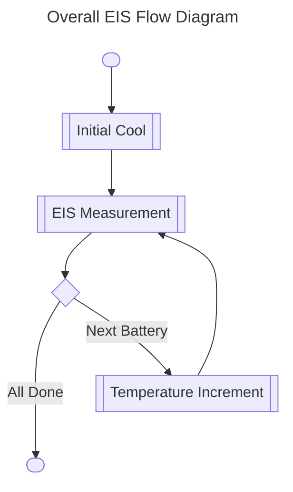
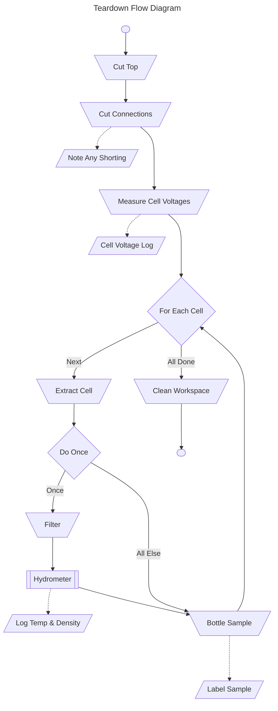

# UCT-uYilo Lead Acid Battery Low Temperature EIS Characterization Testing

Lawrence Stanton  
**January 2024**

## Summary

Building on previous PoC experiments, this experiment shall attempt to accurately correlate the acid quantity and impedance characteristics of Asterion 9Ah 12V lead acid batteries. As new work, the experiment will also venture into low temperature ranges.

## Basic Test Parameters

| Parameter                  |               Value |
| :------------------------- | ------------------: |
| Battery Manufacturer       |            Asterion |
| Nominal Voltage            |            12V (6S) |
| Nominal Capacity           |                 9Ah |
| Maximum Discharge Current  |                2.7A |
| Test Batch Quantity        |            2x10 QTY |
| Expected Manual Time       | 6 Days Intermittent |
| Battery Cycles             |            0 and 50 |
| Estimated Cycling Duration |             17 Days |

A [datasheet](https://asterion-batt.co.za/upload/iblock/df2/HR-12_9.pdf) for the battery is available here: <https://asterion-batt.co.za/upload/iblock/df2/HR-12_9.pdf>

## Ultimate Goals of Measurement

- **Acid Amount**  
  _Specify the amount of acid contained per cell in these specific batteries._
- **Peak Concentration**  
  _Specify the peak concentration, as it relates to peak freezing point depression._
- **Low Temperature EIS Spectra**  
  _Investigate the impedance sensitivity to temperature over a spectrum of frequency._

## Testing Stages

- [ ] 1. [Cycling](#1-cycling-program)[^1]
- [ ] 2. [Varied Discharge](#2-varied-discharge)
- [ ] 3. [EIS Analysis](#3-eis-analysis)
- [ ] 4. [Teardown](#4-teardown)

## Naming Scheme

Please follow the following scheme to identify samples:

| Category            | Naming Type             |
| :------------------ | :---------------------- |
| Order Number        | UCT002                  |
| Prefix              | UCT_AST9AH_             |
| Batch               | Alpha (A, B, C, ...)    |
| Battery             | Numeric (1, 2, 3, ...)  |
| Cell                | Roman (I, II, III, ...) |
| Exception/Destroyed | 'x'                     |

e.g. The fourth cell of battery 6 in the second batch, which experienced some notable event, should be identified as `UCT_AST9AH_B6IVx`.

e.g. The third battery in the first batch should be identified as `UCT_AST9AH_A3`.

> Cells are to be labelled in order of their series connection, starting with `I` as the cell connected to the positive battery terminal.

The project code name is `SISPS`, which may be added if simply `UCT` is insufficient. e.g. `UCT_SISPS_`.

## Test Methodology

### 1. Cycling Program

The batch of 20 total batteries shall be split into two groups of 10. The first group shall not be cycled. The second group shall be cycled for 50 cycles at a 50% depth of discharge, held in the water bath. The recharge program shall follow a `bulk-absorption-float` cycle profile.

Summary test parameters are:

| Parameter                 |         Value |
| :------------------------ | ------------: |
| Discharge Rate            |    1A (1/9 C) |
| Discharge Duration        |     4.5 Hours |
| Depth of Discharge        |           50% |
| Bulk Recharge Rate        | 1.5A (3/18 C) |
| Bulk Cut-off              |         14.4V |
| Absorption Voltage        |         14.2V |
| Absorption Cut-off        |          0.5A |
| Float Voltage             |         13.7V |
| Float Time                |        30 min |
| Estimated Full Cycle Time |       8 Hours |
| Low Voltage Abort         |         11.0V |

Batteries must also be weighed before and after cycling as a check against any gassing.

Batteries may be suspended from the cycling program during the float stage of recharge but should only be done a limited number of times, and all batteries should be interrupted together (as each enters the float stage). i.e. The float duration is not critical. Please report any interruption and the approximate suspended duration. The imperative is to maintain a consistent lifecycle for all batteries in the batch.

If cycling is broken at any stage other than float it must be reported as an exception.

Following completion of cycling, all batteries shall be brought to full charge and left to rest for 24 hours before proceeding to the next stage.[^2]

### 2. Varied Discharge

Each batch of 10 batteries shall be discharged at constant current to achieve a varied profile of depths of discharge. The target SoC range is 40-100% evenly spaced. Discharge parameters are:

| Battery | Discharge Rate | Discharge Duration | Expected State of Charge |
| :------ | -------------: | -----------------: | -----------------------: |
| 1       |             -- |               Zero |                   100.0% |
| 2       |           0.9A |  0.66 hr (0h40min) |                    93.3% |
| 3       |           0.9A |  1.33 hr (1h20min) |                    86.7% |
| 4       |           0.9A |  2.00 hr (2h00min) |                    80.0% |
| 5       |           0.9A |  2.66 hr (2h40min) |                    73.3% |
| 6       |           0.9A |  3.33 hr (3h20min) |                    66.7% |
| 7       |           0.9A |  4.00 hr (4h00min) |                    60.0% |
| 8       |           0.9A |  4.66 hr (4h40min) |                    53.3% |
| 9       |           0.9A |  5.33 hr (5h20min) |                    46.7% |
| 10      |           0.9A |  6.00 hr (6h00min) |                    40.0% |

Leave at full charge until ready. Once discharged, all further tests must be completed within 7 days.

### 3. EIS Analysis

Given the batch of batteries at varied discharge, EIS spectra shall be taken over varied temperatures. The target range is 0 — -40°C, plus a nominal room temperature measurement.

Some deeply discharged batteries (batteries 9 and 10) are expected to be destroyed if brought to the most extreme temperatures, and therefore the following matrix should be used to determine which batteries are to be used at which temperatures:

| Battery | DoD  | -40°C | -30°C | -20°C | -10°C |  0°C  | Room  |
| :------ | :--- | :---: | :---: | :---: | :---: | :---: | :---: |
| 1       | 100% |   X   |   X   |   X   |   X   |   X   |   X   |
| 2       | 93%  |   X   |   X   |   X   |   X   |   X   |   X   |
| 3       | 87%  |   X   |   X   |   X   |   X   |   X   |   X   |
| 4       | 80%  |   X   |   X   |   X   |   X   |   X   |   X   |
| 5       | 73%  |   X   |   X   |   X   |   X   |   X   |   X   |
| 6       | 67%  |   X   |   X   |   X   |   X   |   X   |   X   |
| 7       | 60%  |   X   |   X   |   X   |   X   |   X   |   X   |
| 8       | 53%  |   X   |   X   |   X   |   X   |   X   |   X   |
| 9       | 47%  |       |   X   |   X   |   X   |   X   |   X   |
| 10      | 40%  |       |       |   X   |   X   |   X   |   X   |

Where a battery is not marked, perform no measurement, and insert after the temperature is raised.

The method shall be as follows:

#### Preparation of Thermometer Sacrificial Battery

A sacrificial battery is required as a proxy to measure the core temperatures of the batteries under test. This battery shall be of identical construction to the batteries under test. Due to the requirements of the test, the following should be complied with:

1. The battery must be fully charged, else the heat of fusion may inhibit the cooling process at extreme low temperatures.
2. 35-37wt% Sulphuric Acid may be injected to increase the thermal connection between the battery and the thermometer, if necessary.
3. The top opening and external exposures of the intrusion and thermometer should be reasonably well insulated.

The **undamaged** Asterion battery from the previous experiment may be used for this purpose, and is already at sufficient charge from the factory.  
Please prepare this battery in advance.

> It would be preferable that batteries be placed in close proximity to the thermometer battery some time prior to removal for measurement.

#### Initial Cooling

1. An initial EIS spectrum will be taken for all batteries at room temperature after discharging.
1. All batteries except those which may be excluded shall be placed in the environmental test chamber (ETC).
1. Each battery must be placed with an air gap of at least 5cm between it and any other battery.
1. Overnight, the chamber shall be cooled to the minimum temperature of -40°C. The total cooling period shall be at least 12 hours.
1. The threshold for adequate cooling is to be within ±2°C of the set point for at least 2 consecutive measurements spanning over at least 30 minutes.

#### EIS Measurement

1. The EIS instrument shall be prepared for measurement and tested on a dummy. A rigid adapter module will be supplied by UCT.[^3]
2. The core temperature of the thermometer battery shall be measured, checked to be within ±2°c of the checkpoint, and if so recorded, along with the measurement time and battery DUT open circuit voltage.
3. The battery under test shall be placed into a foam holder and briefly removed from the chamber.[^4]
4. The EIS measurement is performed immediately without delay.
5. The battery is returned to the chamber and the process is repeated.
6. The temperature of the thermometer battery shall be monitored. If the reported temperature rises more than 2°C above the target temperature, the chamber shall be sealed and left to stabilize for at least 30 minutes before continuing.

### Temperature Increment

1. Following completion of the EIS measurements for the previous temperature, the next temperature shall be set and left to stabilize.
2. Successful transition shall be verified and recorded with the thermometer battery under the same ±2°C twice over spaced 30min apart criteria.
3. The minimum warming duration may be reduced from the initial 12h cooling period, but should ideally be at least 6h between transitions.

The overall process should be:

Once the above EIS experimentation is done, all batteries may be left in room temperature and then moved to teardown.

### 4. Teardown

Compared to the previous experiment, the teardown process will be simplified, in the interests of time and experimental volume, to extractions and bottling, with only cell voltages and a hydrometer measurement of one cell. The bottled samples will then be transported to Cape Town for further analytical chemistry.

Otherwise, the following method remains:

1. Cut into the top segment of the battery with the oscillating tool. Attempt to cut through the electrode interconnects, taking care not to short any cells.
2. Break off the top layer of plastic once possible.
3. Cut free each cell from the series connections. Note clearly if any shorting was observed and specify which cells are affected.
4. Measure all cell voltages. Use a high precision multimeter, ideally with at least 4.5 digit precision.
5. Individually extract cells. Delaminate the AGM cell from the leaded plates and squeeze acid into a suitable beaker.
6. Except for the hydrometer sample, decant directly from the beaker into a sample bottle and label. No filtration is necessary.
7. For a single cell, double filter and measure the acid density with the hydrometer. Record the temperature and density. Avoid using a shorted cell if observed. Decant hydrometer sample into a sample bottle and label - **do not discard**.
8. Clean the workspace between each battery to avoid possible cross contamination.

## Final Notes

- Cycling rates may be adjusted slightly to accommodate the available time.
- Sample bottles and labels will be provided by UCT. Please organise other apparatus as necessary, including for filtration.
- Please provide Acetone for rapid cleaning and drying.

[^1]: Only second batch to be cycled.

[^2]: This is done with respect to the second batch, which would be in a rested state having not been cycled.

[^3]: It has proven critical that the connection to the battery remain rigid and uniform in contact pressure. Quick disconnects are not suitable, given their limited rated connect/disconnect count, as the loss of contact pressure over time. Crocodile clips solve this, but require support to prevent rotation.

[^4]: At no stage may the battery come into direct thermal contact with an uninsulated object, such as a hand, table surface, or other battery.
